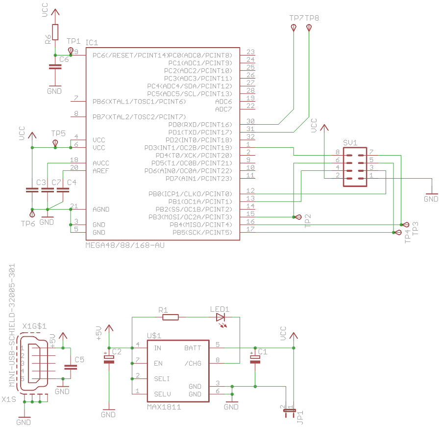
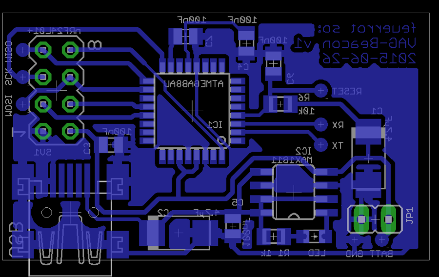

# VideoAG Projekt: Beacon

Hardware ist an unbekannten Orten. Aber für die Aufnahme von Vorlesungen wüssten wir gerne, welche Hardware sich wo befindet. Die Lösung: Ein Beacon.
Auf der Basis eines nRF24L01+ und eines AVR wird so ein preiswertes und stromsparendes Stück Hardware implementiert, die sich jeweils am Equipment befindet und in regelmäßigen Intervallen eine eindeutige ID aussendet. Diese ID wird dann von einem dauerhaft lauschenden Empfänger verarbeitet.

## Projektstatus

Es existiert eine weitgehend stabile und laut Datenblätter stromsparende Idee für die Beacons. Platinen wurden designed und geätzt.
Nächster Schritt: Platinen bestücken und die Firmware anfangen zu entwickeln.

## Layout und so

### Schaltplan

### Layout

